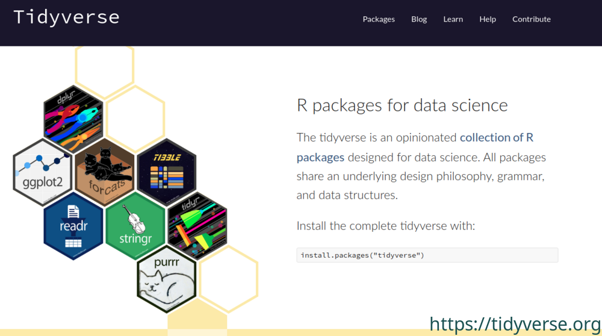
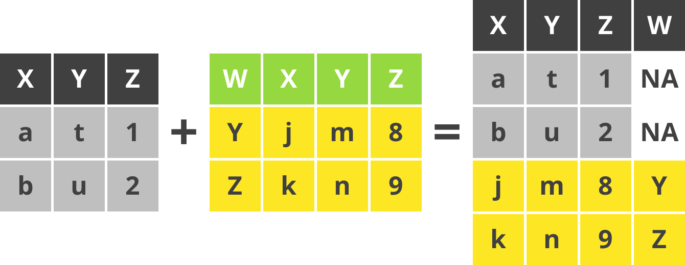
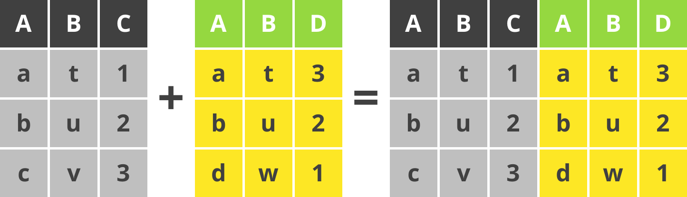
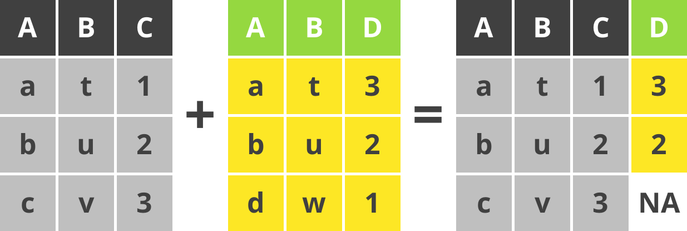
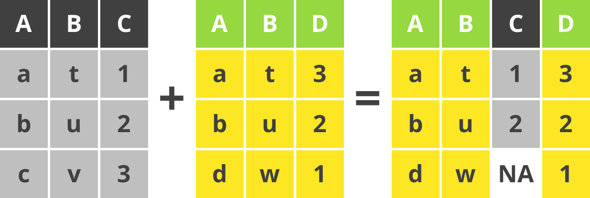
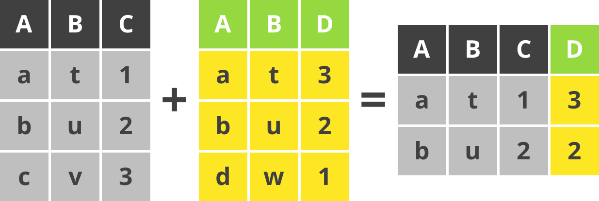
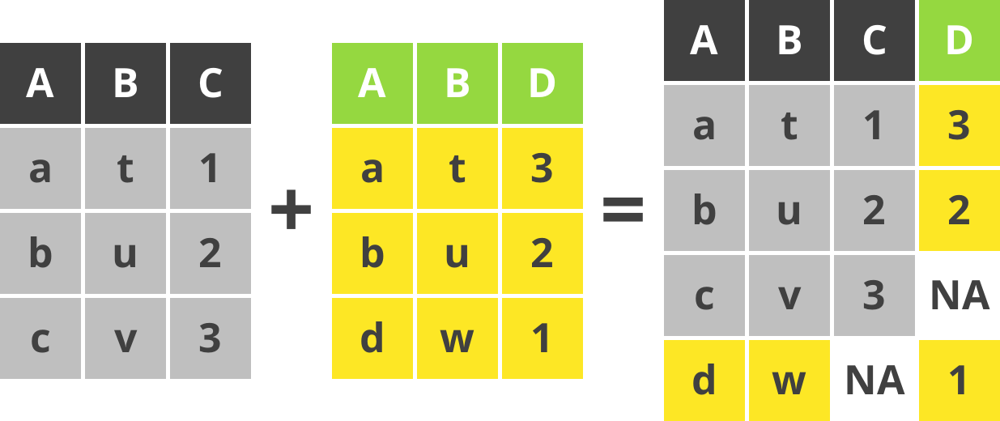
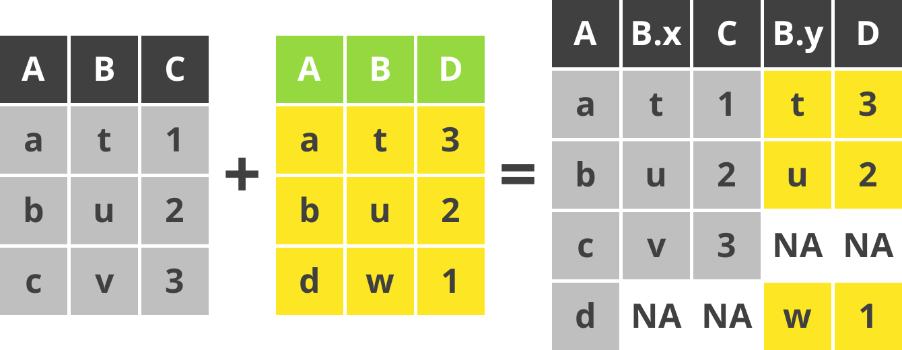
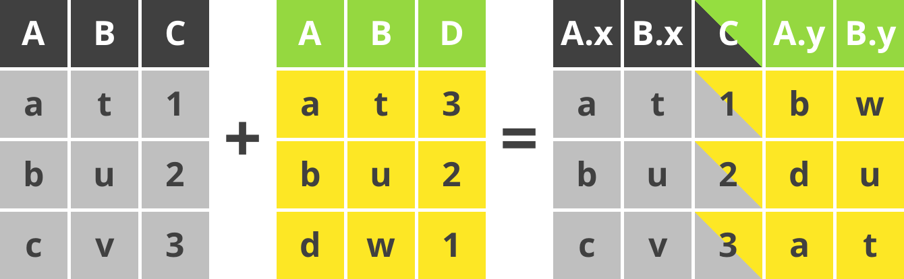

```{r setup, include=FALSE}
options(htmltools.dir.version = FALSE)
knitr::opts_chunk$set("fig.align" = "center")
library("tidyverse")
library("ggpubr")
library("lemon")
library("magick")
```

```{r xaringan-themer, include=FALSE, warning=FALSE}
library(xaringanthemer)
style_mono_accent(
  base_color = "#1c5253",
  base_font_size = "18px",
  header_font_google = google_font("Noto Sans JP", "900"),
  text_font_google   = google_font("Noto Sans JP", "400", "500"),
  code_font_google   = google_font("Fira Mono")
)
```


# Workshop について


**スケジュール**

* 13:00 -- 14:30　効率的なデータ処理 (tidyverse の紹介)
* 14:30 -- 14:45　休憩・質疑応答
* 14:45 -- 16:15　論文投稿用の作図方法 (ggplot2 の紹介)
* 16:15 -- 17:00　質疑応答


**tidyverse**, **ggpubr**, **lemon**のパッケージをインストールしてください。

```{r eval=FALSE, tidy=FALSE}
install.packages(c("tidyverse", "ggpubr", "lemon"))
```

**tidyverse** は、**ggplot2**, **dplyr**, **tidyr**, **readr**, **purrr**, **tibble**, **stringr**, **forcats**の８つのパッケージをまとめたパッケージです。

**ggpubr** と **lemon** は **ggplot2** の補助パッケージです。

---

## `tidyverse` とは

* [開発者：Hadley Wickham (@hadleywickham; RStudio Chief Scientist)](http://hadley.nz/)
* [useR2016](https://twitter.com/hadleywickham/status/959507805282582528) ではじめて紹介されました。
* コアパッケージ以外の `tidyverse` パッケージは `tidyverse_packages()` で確認できます。

.centerfig[
[
```{r, echo = FALSE, cache = TRUE, out.width = "70%"}
image_read("web_images/tidyverse.png") %>% 
  image_resize(geometry = "1000x") %>% 
  image_annotate("https://tidyverse.org",
                       size = 30,
                       font = "Noto Sans",
                       gravity = "southeast",
                       color = "#1c5253") %>% 
  image_write(path = "web_images/tidyverse_link.png")

```
](https://tidyverse.org)
]

---

## パイプ (pipe) とは

.pull-left[

* `tidyverse` といえば、パイプ
* ` %>% `
* RStudio では **`SHIFT+CTRL+M`** で入力できます。
* Linux ユーサーになじみのある演算子 (operator)
]

.pull-right[

```{r, eval = F}
# Example 1
z = f(x) # ベース R
z = x %>% f(.) # tidyverse

# Example 2
z = f(g(x)) # ベース R
z = x %>% f() %>% g() # tidyverse

# Example 3
z = f(x, y) # ベース R
z = x %>% f(y)# tidyverse
```

]

-------------------

* `%>%` の左辺 `x` を右辺 `f()` に渡すために使います。
* 特別に指定しなければ、左辺 `x` は `f()` の第 1 引数に渡されます。


---

## `tibble` は機能的なデータフレーム

```{r, eval = FALSE}
iris # base R data frame
```

```{r}
head(iris)
```

データフレーべム (data frame) は変数<sup>1</sup> (variable) と観測値<sup>2</sup> (observation) を正方形の表にまとめたオブジェクト (object) です。

.footnote[
<sup>1</sup>変数は列; <sup>2</sup>観測値は行
]

---

## `tibble` は機能的なデータフレーム

```{r}
as_tibble(iris) # tidyverse tibble
```

変数のクラス (class) と tibble の大きさ (この場合は 150 行 5 列) などを教えくれます。
`print()` メソッド (method) はデフォルトで 10 行表示してくれます。

---

## **代入演算子 (assignment operator) **　のメモ

**代入演算子 (assignment operator) **

`?assignOps` が代入演算子のヘルプです。

* **`-> ->>`**           右から左への代入
* **`<- <<-`**           左から右への代入
* **`=`**                左から右への代入

**`=`** は R のトップレベルと部分式 (subexpression) にしか使えない。書きやすいので、おすすめします。

**`-> <-`** はどこからでも使える。

**`->> <<-`** もどこからでも使えるが、部分式外側にある変数に代入できる。永続代入演算子といいます。

---

class: center, middle
# `tidyverse` 文法の基本

---

## よく使う関数（動詞; verbs）

* **`read_csv()`**: CSVファイルをよむ（ベース R の `read.csv()` より使い勝手がいいです）。
* **`mutate()`**: 新しい変数をつくる。
* **`filter()`**: フィルターをかける。
* **`select()`**: 変数をえらぶ。
* **`summarise()`**: 集計する（ベース R の `summary()` と区別しましょう）。
* **`group_by()`**: グループ化する。 

**`readxl`** パッケージには

* **`read_xlsx()`**: XLSXファイルをよむ。

**`lubridate`** パッケージには

* **`parse_datetime()`**: 日時データの定義につかう。


---

## `filter()` のデモ

```{r}
iris %>% as_tibble() %>% print(n = 2)
```

`filter()` を使って、`Sepal.Length <= 5` のデータを抽出します。
```{r}
iris %>% as_tibble() %>% filter(Sepal.Length <= 5) %>% print(n = 2)
```

---

## `mutate()` のデモ

`mutate()` を使って、`Sepal.Length` と `Sepal.Width` の比 (`Ratio`) を求めます。

```{r}
iris %>% as_tibble() %>% mutate(Ratio = Sepal.Length / Sepal.Width)
```

---

## `summarise()` のデモ

.pull-left[

`sumarise()` を使って、`Sepal.Length`　の平均値を求めます。

```{r}
iris %>% as_tibble() %>% 
  summarise(Mean.Value = mean(Sepal.Length))
```
]

.pull-right[

`group_by()` を使えば、`Species` 毎の平均値も求められます。

```{r}
iris %>% group_by(Species) %>% 
  summarise(Mean.Value = mean(Sepal.Length))
```

ベース R のデータフレームを `tibble` に変換せずに、`tidyverse` の関数は使えます。
]

---

class: center, middle

# `tibble` の変形

---

## `tibble` の縦長・横広変形

縦長 (long-format) `r icons::fontawesome("arrows-alt-h")` 横広 (wide-format) への変換は pivoting といいます。

`pivot_longer` をつかって `iris` を横広から縦長へ変換します。

```{r, eval = F}
iris %>% pivot_longer(cols = matches("^Sep|^Pet")) 
```

.pull-left[

```{r, echo = F}
iris %>% pivot_longer(cols = matches("^Sep|^Pet")) 
```

]

.pull-right[

`matches()` は[正規表現](https://ja.wikipedia.org/wiki/%E6%AD%A3%E8%A6%8F%E8%A1%A8%E7%8F%BE) により変数（列名）を選択します。
ここでは、`Sep` または `Pet` の文字から始まる (^) 変数と一致した列名を選択します。

]


---

## `tibble` の縦長・横広変形

`pivot_wider()` は `tibble` を縦長から横広へ変換します。

```{r}
InsectSprays %>% 
  pivot_wider(names_from = spray, values_from = count)
```

ここでは Warning がでました。
「観測値の区別がきない」と警告しています。
結果は list として出力しました。

---

## `tibble` の縦長・横広変形

Warning は次のように解決できます。
```{r, eval = F}
InsectSprays %>% 
  pivot_wider(names_from = spray, 
              values_from = count,
              values_fn = list) %>% 
  unnest(everything())
```

.pull-left[
```{r, echo = F}
InsectSprays %>% 
  pivot_wider(names_from = spray, 
              values_from = count,
              values_fn = list) %>% 
  unnest(everything()) %>% 
  print(n = 6)
```
]

.pull-right[
* `values_fn = list` を指定して、Warning を抑えました。
* `unnest()` を使って、たたまれた　`list` 変数を開きました。
* `everything()` を `unnest()` に渡すと、たたまれているすべての変数を開くようにします。
]

---

class: center, middle

# 複数 `tibble` の結合

---

## 結合方法 (binding rows)

**`bind_rows(A, B)`**

```{r, echo=FALSE}

```

`bind_rows()` はデータセット `A` に データセット `B`を追加します。

---

## 結合方法 (binding columns)

**`bind_cols(X, Y)`**

```{r, echo=FALSE}

```

`bind_cols()` はデータセット `X` に データセット `Y` の変数を追加します。

---

## 結合方法 (left join)

**`left_join(X, Y)`**

```{r, echo=FALSE}

```

`left_join()` は左のデータセット `X` を優先して `X` と `Y` の列と行を結合します。

---

## 結合方法 (right)

**`right_join(X, Y)`**

```{r, echo=FALSE}

```

`right_join()` は右のデータセット `Y` を優先して `X` と `Y` の列と行を結合します。


---

## 結合方法 (inner)

**`inner_join(X, Y)`**

```{r, echo=FALSE}

```

`inner_join()` は `X` と `Y` で共通して存在する列だけ結合します。

---

## 結合方法 (full join)

**`full_join(X, Y)`**

```{r, echo=FALSE}

```

`full_join()` はすべての列と行を結合します。
お互いに該当しない場合は `NA` になります。

---

## 結合方法 (full join by A)

**`full_join(X, Y, by = "A")`**

```{r, echo=FALSE}

```

`full_join()` の `by` 引数に "`A`" を指定しました。
`X` と `Y` の `A` 変数を軸にして列と行を結合します。
お互いに該当しない場合は `NA` になります。

---


## 結合方法 (full join by C=D)

**`full_join(X, Y, by = c("C" = "D"))`**

```{r, echo=FALSE}

```

`full_join()` の `by` 引数に `c("C" = "D")` を指定しました。
`X` の `C` 変数 と `Y` の `D`  変数を合わせて列と行を結合します。
お互いに該当しない場合は `NA` になります。

**`left_join()`, `right_join()`, `inner_join()` にも `by` 引数があります。**

---
