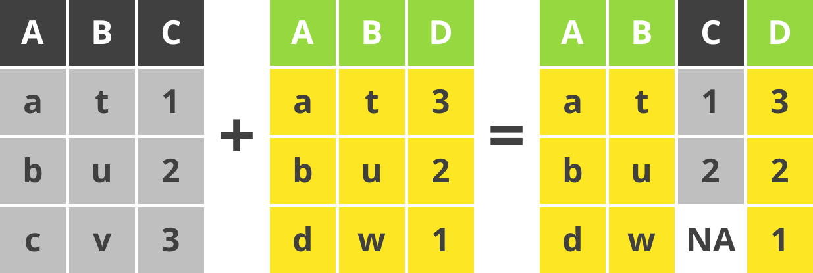
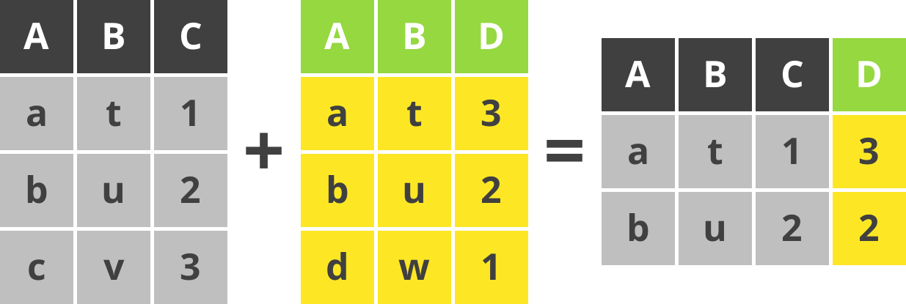
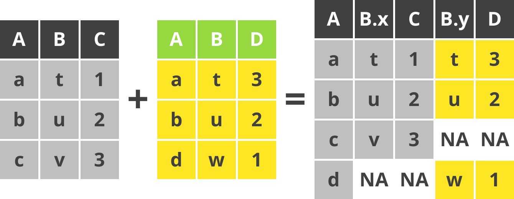

```{r setup, include=FALSE}
options(htmltools.dir.version = FALSE)
knitr::opts_chunk$set(dpi=300, fig.width = 80/25.4, fig.height = 80/25.4, fig.align = "center")
library("tidyverse")
library("ggpubr")
library("lemon")
library("showtext")
library("magick")
```

```{r xaringan-themer, include=FALSE, warning=FALSE}
library(xaringanthemer)
style_mono_accent(
  base_color = "#1c5253",
  base_font_size = "18px",
  header_font_google = google_font("Noto Sans JP", "900"),
  text_font_google   = google_font("Noto Sans JP", "400", "500"),
  code_font_google   = google_font("Fira Mono")
)
```


# Workshop について


**スケジュール**

* 13:00 -- 14:30　効率的なデータ処理 (tidyverse の紹介)
* 14:30 -- 14:45　休憩・質疑応答
* 14:45 -- 16:15　論文投稿用の作図方法 (ggplot2 の紹介)
* 16:15 -- 17:00　質疑応答


**tidyverse**, **ggpubr**, **lemon**のパッケージをインストールしてください。

```{r eval=FALSE, tidy=FALSE}
install.packages(c("tidyverse", "ggpubr", "lemon"))
```

**tidyverse** は、**ggplot2**, **dplyr**, **tidyr**, **readr**, **purrr**, **tibble**, **stringr**, **forcats**の８つのパッケージをまとめたパッケージです。

**ggpubr** と **lemon** は **ggplot2** の補助パッケージです。

---

## `tidyverse` とは

* [開発者：Hadley Wickham (@hadleywickham; RStudio Chief Scientist)](http://hadley.nz/)
* [useR2016](https://twitter.com/hadleywickham/status/959507805282582528) ではじめて紹介されました。
* コアパッケージ以外の `tidyverse` パッケージは `tidyverse_packages()` で確認できます。

.centerfig[
[
```{r, echo = FALSE, cache = TRUE, out.width = "70%"}
image_read("web_images/tidyverse.png") %>% 
  image_resize(geometry = "1000x") %>% 
  image_annotate("https://tidyverse.org",
                       size = 30,
                       font = "Noto Sans",
                       gravity = "southeast",
                       color = "#1c5253") %>% 
  image_write(path = "web_images/tidyverse_link.png")
knitr::include_graphics("web_images/tidyverse_link.png")
```
](https://tidyverse.org)
]

---

## パイプ (pipe) とは

.pull-left[

* `tidyverse` といえば、パイプ
* ` %>% `
* RStudio では **`SHIFT+CTRL+M`** で入力できます。
* Linux ユーサーになじみのある演算子 (operator)
]

.pull-right[

```{r, eval = F}
# Example 1
z = f(x) # ベース R
z = x %>% f(.) # tidyverse

# Example 2
z = f(g(x)) # ベース R
z = x %>% f() %>% g() # tidyverse

# Example 3
z = f(x, y) # ベース R
z = x %>% f(y)# tidyverse
```

]

-------------------

* `%>%` の左辺 `x` を右辺 `f()` に渡すために使います。
* 特別に指定しなければ、左辺 `x` は `f()` の第 1 引数に渡されます。


---

## `tibble` は機能的なデータフレーム

```{r, eval = FALSE}
iris # base R data frame
```

```{r}
head(iris)
```

データフレーべム (data frame) は変数<sup>1</sup> (variable) と観測値<sup>2</sup> (observation) を正方形の表にまとめたオブジェクト (object) です。

.footnote[
<sup>1</sup>変数は列; <sup>2</sup>観測値は行
]

---

## `tibble` は機能的なデータフレーム

```{r}
as_tibble(iris) # tidyverse tibble
```

変数のクラス (class) と tibble の大きさ (この場合は 150 行 5 列) などを教えくれます。
`print()` メソッド (method) はデフォルトで 10 行表示してくれます。

---

## **代入演算子 (assignment operator) **　のメモ

**代入演算子 (assignment operator) **

`?assignOps` が代入演算子のヘルプです。

* **`-> ->>`**           右から左への代入
* **`<- <<-`**           左から右への代入
* **`=`**                左から右への代入

**`=`** は R のトップレベルと部分式 (subexpression) にしか使えない。書きやすいので、おすすめします。

**`-> <-`** はどこからでも使える。

**`->> <<-`** もどこからでも使えるが、部分式外側にある変数に代入できる。永続代入演算子といいます。

---

class: center, middle
# `tidyverse` 文法の基本

---

## よく使う関数（動詞; verbs）

* **`read_csv()`**: CSVファイルをよむ（ベース R の `read.csv()` より使い勝手がいいです）。
* **`mutate()`**: 新しい変数をつくる。
* **`filter()`**: フィルターをかける。
* **`select()`**: 変数をえらぶ。
* **`summarise()`**: 集計する（ベース R の `summary()` と区別しましょう）。
* **`group_by()`**: グループ化する。 

**`readxl`** パッケージには

* **`read_xlsx()`**: XLSXファイルをよむ。

**`lubridate`** パッケージには

* **`parse_datetime()`**: 日時データの定義につかう。


---

## `filter()` のデモ

```{r}
iris %>% as_tibble() %>% print(n = 2)
```

`filter()` を使って、`Sepal.Length <= 5` のデータを抽出します。
```{r}
iris %>% as_tibble() %>% filter(Sepal.Length <= 5) %>% print(n = 2)
```

---

## `mutate()` のデモ

`mutate()` を使って、`Sepal.Length` と `Sepal.Width` の比 (`Ratio`) を求めます。

```{r}
iris %>% as_tibble() %>% mutate(Ratio = Sepal.Length / Sepal.Width)
```

---

## `summarise()` のデモ

.pull-left[

`sumarise()` を使って、`Sepal.Length`　の平均値を求めます。

```{r}
iris %>% as_tibble() %>% 
  summarise(Mean.Value = mean(Sepal.Length))
```
]

.pull-right[

`group_by()` を使えば、`Species` 毎の平均値も求められます。

```{r}
iris %>% group_by(Species) %>% 
  summarise(Mean.Value = mean(Sepal.Length))
```

ベース R のデータフレームを `tibble` に変換せずに、`tidyverse` の関数は使えます。
]

---

class: center, middle

# `tibble` の変形

---

## `tibble` の縦長・横広変形

縦長 (long-format) `r icons::fontawesome("arrows-alt-h")` 横広 (wide-format) への変換は pivoting といいます。

`pivot_longer` をつかって `iris` を横広から縦長へ変換します。

```{r, eval = F}
iris %>% pivot_longer(cols = matches("^Sep|^Pet")) 
```

.pull-left[

```{r, echo = F}
iris %>% pivot_longer(cols = matches("^Sep|^Pet")) 
```

]

.pull-right[

`matches()` は[正規表現](https://ja.wikipedia.org/wiki/%E6%AD%A3%E8%A6%8F%E8%A1%A8%E7%8F%BE) により変数（列名）を選択します。
ここでは、`Sep` または `Pet` の文字から始まる (^) 変数と一致した列名を選択します。

]


---

## `tibble` の縦長・横広変形

`pivot_wider()` は `tibble` を縦長から横広へ変換します。

```{r}
InsectSprays %>% 
  pivot_wider(names_from = spray, values_from = count)
```

ここでは Warning がでました。
「観測値の区別がきない」と警告しています。
結果は list として出力しました。

---

## `tibble` の縦長・横広変形

Warning は次のように解決できます。
```{r, eval = F}
InsectSprays %>% 
  pivot_wider(names_from = spray, 
              values_from = count,
              values_fn = list) %>% 
  unnest(everything())
```

.pull-left[
```{r, echo = F}
InsectSprays %>% 
  pivot_wider(names_from = spray, 
              values_from = count,
              values_fn = list) %>% 
  unnest(everything()) %>% 
  print(n = 6)
```
]

.pull-right[
* `values_fn = list` を指定して、Warning を抑えました。
* `unnest()` を使って、たたまれた　`list` 変数を開きました。
* `everything()` を `unnest()` に渡すと、たたまれているすべての変数を開くようにします。
]

---

class: center, middle

# 複数 `tibble` の結合

---

## 結合方法 (binding rows)

**`bind_rows(A, B)`**

```{r, echo=FALSE}
knitr::include_graphics("pngs/bind_rows_eqn.png")
```

`bind_rows()` はデータセット `A` に データセット `B`を追加します。

---

## 結合方法 (binding columns)

**`bind_cols(X, Y)`**

```{r, echo=FALSE}
knitr::include_graphics("pngs/bind_cols_eqn.png")
```

`bind_cols()` はデータセット `X` に データセット `Y` の変数を追加します。

---

## 結合方法 (left join)

**`left_join(X, Y)`**

```{r, echo=FALSE}
knitr::include_graphics("pngs/left_join_eqn.png")
```

`left_join()` は左のデータセット `X` を優先して `X` と `Y` の列と行を結合します。

---

## 結合方法 (right)

**`right_join(X, Y)`**

```{r, echo=FALSE}

```

`right_join()` は右のデータセット `Y` を優先して `X` と `Y` の列と行を結合します。


---

## 結合方法 (inner)

**`inner_join(X, Y)`**

```{r, echo=FALSE}

```

`inner_join()` は `X` と `Y` で共通して存在する列だけ結合します。

---

## 結合方法 (full join)

**`full_join(X, Y)`**

```{r, echo=FALSE}
knitr::include_graphics("pngs/full_join_eqn.png")
```

`full_join()` はすべての列と行を結合します。
お互いに該当しない場合は `NA` になります。

---

## 結合方法 (full join by A)

**`full_join(X, Y, by = "A")`**

```{r, echo=FALSE}

```

`full_join()` の `by` 引数に "`A`" を指定しました。
`X` と `Y` の `A` 変数を軸にして列と行を結合します。
お互いに該当しない場合は `NA` になります。

---


## 結合方法 (full join by C=D)

**`full_join(X, Y, by = c("C" = "D"))`**

```{r, echo=FALSE}
knitr::include_graphics("pngs/full_join_byCD_eqn.png")
```

`full_join()` の `by` 引数に `c("C" = "D")` を指定しました。
`X` の `C` 変数 と `Y` の `D`  変数を合わせて列と行を結合します。
お互いに該当しない場合は `NA` になります。

**`left_join()`, `right_join()`, `inner_join()` にも `by` 引数があります。**

---


class: center, middle

# `ggplot2`

---


## `ggplot2` のデフォルト

```{r, eval = FALSE}
ggplot(iris) + #<<
  geom_boxplot(aes(x = Species, y = Petal.Length))
```

.pull-left[

```{r, echo = FALSE}
ggplot(iris) + #<<
  geom_boxplot(aes(x = Species, y = Petal.Length))
```
]

.pull-right[

ハイライト部分で `ggplot` のベースレイヤーを定義します。

* 第 1 引数はデータ (data.frame, tibble)
* 第 2 引数はマッピング (図に使う変数)
* `ggplot()` に情報を渡すと、下流のプロットメソッドのデフォルトになります。
]

---

## `ggplot2` のデフォルト

```{r, eval = FALSE}
ggplot(iris) + 
  geom_boxplot(aes(x = Species, y = Petal.Length)) #<<
```

.pull-left[

```{r, echo = FALSE}
ggplot(iris) + 
  geom_boxplot(aes(x = Species, y = Petal.Length)) #<<
```
]

.pull-right[

`geom_boxplot()` は箱ひげ図の関数です。

* 第 1 引数はマッピング (図に使う変数) です。マッピングは `aes()` 関数でします。
* 第 2 引数はデータ (data.frame, tibble) です。
* 他の引数は `?geom_boxplot` で確認できます。
* `geom_boxplot()` にデータやマッピングを渡せば、`ggplot()` に渡した情報を無視できます。
]

---

## `iris` の図に軸タイトルを追加

```{r, eval = FALSE}
ggplot(iris) + 
  geom_boxplot(aes(x = Species, y = Petal.Length)) +
  scale_x_discrete("Species") + #<<
  scale_y_continuous("Petal length (mm)") #<<
```

.pull-left[

```{r, echo = FALSE}
ggplot(iris) + 
  geom_boxplot(aes(x = Species, y = Petal.Length)) +
  scale_x_discrete("Species") +
  scale_y_continuous("Petal length (mm)")
```
]

.pull-right[

x軸が因子のとき、`scale_x_discrete()`を使います。連続変数のときは `scale_x_continuous()` です。

* 第 1 引数は軸のラベルです。
* `breaks` 引数で軸の区切りを変えられます。
* `limits` 引数で軸の範囲を指定できます。
* 他の引数は `?scale_x_discrete` または `scale_x_continuous` で確認できます。
]

---

## `iris` の図の背景を投稿用に

```{r, eval = FALSE}
ggplot(iris) + 
  geom_boxplot(aes(x = Species, y = Petal.Length)) +
  scale_x_discrete("Species") + 
  scale_y_continuous("Petal length (mm)") +
  theme_pubr() #<<
```

.pull-left[

```{r, echo = FALSE}
ggplot(iris) + 
  geom_boxplot(aes(x = Species, y = Petal.Length)) +
  scale_x_discrete("Species") +
  scale_y_continuous("Petal length (mm)") +
  theme_pubr() #<<
```
]

.pull-right[

`theme_pubr()` は `ggpubr` パッケージの関数です。これで簡単に図の見せ方を変えられます。

* 第 1 引数は軸のラベルです。
* `breaks` 引数で軸の区切りを変えられます。
* `limits` 引数で軸の範囲を指定できます。
* 他の引数は `?scale_x_discrete` または `scale_x_continuous` で確認できます。
]

---

## `ggplot` をファイルに保存

```{r, eval = FALSE}
ggsave(filename = "figure01.png", plot = figure01,
       width = 80, height = 80, dpi = 300, units = "mm")
```

.pull-left[
* `filename`: ファイル名、ファイル形式は拡張子できまります。
* `plot`: `ggplot`オブジェクト、デフォルトは最後に表示された図です。
]

.pull-right[
* `width`, `height`, `units`: 図の寸法と寸法の単位。
* `dpi`: ラスターグラフィックの場合は解像度、ベクターグラフィックの場合は不要。注意: `dpi` の設定によって、保存したフォントの大きさが変わります。
]

---

## `iris` の箱ひげ図の出力

解像度 96 と 300 の PNG ファイルを保存します。

```{r}
figure01 = ggplot(iris) + 
  geom_boxplot(aes(x = Species, y = Petal.Length)) +
  scale_x_discrete("Species") +
  scale_y_continuous("Petal length (mm)") +
  theme_pubr(base_size = 10) 

# Resolution is 96
ggsave(filename = "figure01_96.png", plot = figure01,
       width = 80, height = 80, dpi = 96, units = "mm")

# Resolution is 300
ggsave(filename = "figure01_300.png", plot = figure01,
       width = 80, height = 80, dpi = 300, units = "mm")
```


---

## `iris` png ファイル

.pull-left[

**保存した解像度 96 のフィアル**

```{r, echo = FALSE, out.width="90%"}
knitr::include_graphics("figure01_96.png")
```
]

.pull-right[

**保存した解像度 300 のフィアル**

```{r, echo = FALSE, out.width="90%"}
knitr::include_graphics("figure01_300.png")
```
]

---


## RStudio の解像度とフォントサイズ問題

.pull-left[

**インタラクティブ (interactive) でないとき**

```{r, echo = FALSE}
knitr::include_graphics("figure01_300.png")
```
]

.pull-right[

**インタラクティブであるとき**

```{r, echo = FALSE}
knitr::include_graphics("figure01_300_interactive.png")
```

]

**注意:** RStudio をインタラクティブに使っているときに図を保存したら、フォントサイズは解像度に合わない。図のフォントサイズは 10 解像度は 300 です。

**解決方法:** R スクリプトを `Source` (`CTRL+SHIFT+S`)  すれば、フォントサイズと解像度のスケーリング問題が消えます。


---

## Publication ready figures

**最もシンプルな方法**

1. 図はPDFまたはSVGファイルとして保存
2. Imagemagick、GIMP、Inkscape、Adobe Photoshop/Illustrator などのソフトで変換


```{r, eval = FALSE}
figure01 = ggplot(iris) + 
  geom_boxplot(aes(x = Species, y = Petal.Length)) +
  scale_x_discrete("Species") +
  scale_y_continuous("花びらの長さ (mm)") +
  theme_pubr()

ggsave("figure01.pdf", plot = figure01, 
       width = 80, height = 80, units = "mm", 
       device = cairo_pdf)
```

**重要:** `ggsave()` に `device = cairo_pdf` を渡しました。`Cairo graphics library` はユニコード文字を正しくPDFに埋め込んでくれるので、好みのフォントも使えるようになります。

---

## システムフォントの埋め込み

システムフォントを R の図に使うなら、`showtext` パッケージがあるととても楽です。
```{r, eval = FALSE}
library(showtext)
font_paths() # Show the system font paths
font_files() # Show the system font files
```

```{r}
font_add("notoserifcjk", regular = "NotoSerifCJKjp-Regular.otf")
showtext_auto()
figure02 = ggplot(iris) + 
  geom_boxplot(aes(x = Species, y = Petal.Length)) +
  scale_x_discrete("種") +
  scale_y_continuous("花びらの長さ (mm)") +
  theme_pubr(base_family = "notoserifcjk") 

ggsave("figure02.pdf", 
       plot = figure02, 
       width = 80, height = 80, units = "mm", device = cairo_pdf)
```
```{r, echo = FALSE}
image_read_pdf("figure02.pdf", density = 600) %>% 
  image_write("figure02_convert.png",
              density = 300,
              flatten = TRUE,
              depth = 8)
```

---

## システムフォントの埋め込み

```{r, echo = FALSE, out.width="60%"}
knitr::include_graphics("figure02_convert.png")
```

---

## システムフォントの埋め込み

```{r, eval = FALSE}
font_add("notoserif", 
         regular = "NotoSerifCJKjp-Regular.otf",
         italic = "NotoSerif-Italic.ttf")
showtext_auto()

xlabel = iris %>% pull(Species) %>% levels()
xlabel = str_glue("italic('I.')~italic('{xlabel}')")

iris %>% 
  ggplot() + 
  geom_point(aes(x = Species, y = Petal.Length, color = Species),
             position = position_jitter(0.1),
             alpha = 0.8) +
  scale_x_discrete("種", label = parse(text = xlabel)) +
  scale_y_continuous("花びらの長さ (mm)",
                     limits = c(0, 8),
                     breaks = seq(0, 8, by = 2)) +
  scale_color_manual(label = parse(text = xlabel),
                     values = viridis::viridis(4)) +
  theme_pubr(base_family = "notoserif") + 
  theme(legend.title = element_blank(),
        legend.background = element_blank(),
        legend.position = c(0,1),
        legend.justification = c(0,1),
        legend.text.align = 0)
```

---

## システムフォントの埋め込み

```{r, echo = FALSE,  fig.width=80/25.4 * 1.5}
font_add("notoserif", 
         regular = "NotoSerifCJKjp-Regular.otf",
         italic = "NotoSerif-Italic.ttf")
showtext_auto()

xlabel = iris %>% pull(Species) %>% levels()
xlabel = str_glue("italic('I.')~italic('{xlabel}')")

iris %>% 
  ggplot() + 
  geom_point(aes(x = Species, y = Petal.Length, color = Species),
             position = position_jitter(0.1),
             alpha = 0.8) +
  scale_x_discrete("種", label = parse(text = xlabel)) +
  scale_y_continuous("花びらの長さ (mm)",
                     limits = c(0, 8),
                     breaks = seq(0, 8, by = 2)) +
  scale_color_manual(label = parse(text = xlabel),
                     values = viridis::viridis(4)) +
  theme_pubr(base_family = "notoserif") + 
  theme(legend.title = element_blank(),
        legend.background = element_blank(),
        legend.position = c(0,1),
        legend.justification = c(0,1),
        legend.text.align = 0)
```

---

## システムフォントの埋め込み

```{r, echo = FALSE,  fig.width=80/25.4 * 1.5}
yname = "'BOD'~(mg~L^{-1})"

ggplot(BOD) + 
  geom_point(aes(x = Time, y = demand)) +
  scale_x_continuous("Time (days)", 
                     limits = c(0, 7),
                     breaks = 0:7) +
  scale_y_continuous(name = parse(text = yname),
                     limits = c(0, 20)) +
  theme_pubr(base_family = "notoserif") 
```
---


## システムフォントの埋め込み

```{r, echo = FALSE,  fig.width=80/25.4 * 1.5}
yname = "'BOD'~(mg~L^{-1})"

m1 = glm(demand ~ Time, data = BOD, family = gaussian("identity"))

expectations = BOD %>% expand(Time = seq(1, 7, by = 0.5)) %>% 
  mutate(fit = predict(m1, newdata = ., type = "response")) %>% 
  mutate(se = predict(m1, newdata = ., type = "response", se.fit = T)$se) 

ggplot() + 
  geom_ribbon(aes(x = Time, ymin = fit - 2 * se, ymax = fit + 2 * se),
              alpha = 0.6,
              data = expectations) +
    geom_line(aes(x = Time, y = fit), data = expectations) +
  geom_point(aes(x = Time, y = demand), 
             data = BOD) +
  scale_x_continuous("Time (days)", 
                     limits = c(0, 7),
                     breaks = 0:7) +
  scale_y_continuous(name = parse(text = yname)) +
  theme_pubr(base_family = "notoserif") 

```
---


## Convert with ImageMagick

[ImageMagick](https://imagemagick.org/) は画像を操作するためのソフトです。
[`magick`](https://cran.r-project.org/web/packages/magick/vignettes/intro.html) は ImageMagick のラッパー (wrapper) です。


```{r, eval = FALSE}
library(magick)
img = image_read_pdf("figure01.pdf", density = 600)
img %>% image_write("figure01_convert.tif",
              density = 300,
              format = "tif",
              flatten = TRUE,
              depth = 8,
              compression = "lzw")
```

--- 
