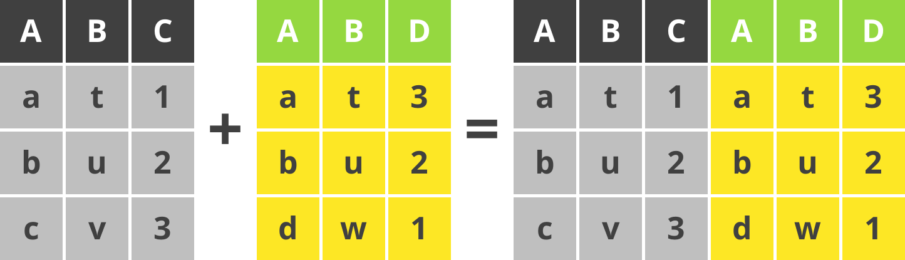
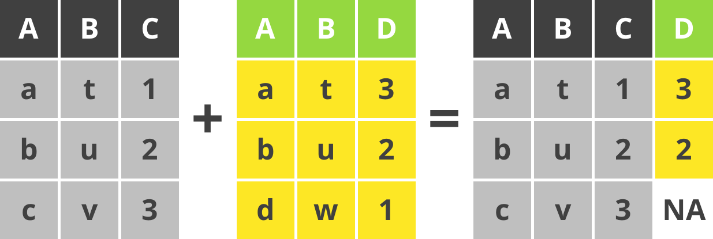
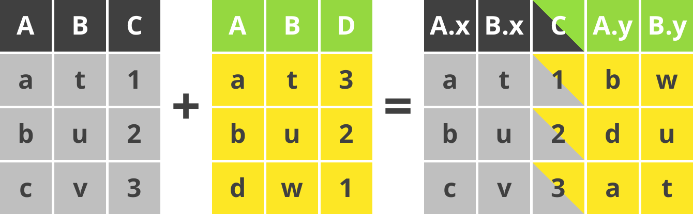

```{r setup, include=FALSE}
options(htmltools.dir.version = FALSE)
knitr::opts_chunk$set(dpi=300, fig.width = 80/25.4, fig.height = 80/25.4, fig.align = "center")
library("tidyverse")
library("ggpubr")
library("lemon")
library("showtext")
library("magick")
library("patchwork")
```

```{r xaringan-themer, include=FALSE, warning=FALSE}
library(xaringanthemer)
style_mono_accent(
  base_color = "#1c5253",
  base_font_size = "18px",
  header_font_google = google_font("Noto Sans JP", "900"),
  text_font_google   = google_font("Noto Sans JP", "400", "500"),
  code_font_google   = google_font("Fira Mono")
)
```


# Workshop について

.content-box-green[

**スケジュール**

* 13:00 -- 14:30　効率的なデータ処理 (tidyverse の紹介)
* 14:30 -- 14:45　休憩・質疑応答
* 14:45 -- 16:15　論文投稿用の作図方法 (ggplot2 の紹介)
* 16:15 -- 17:00　質疑応答

]

**tidyverse**, **ggpubr**, **lemon**, **viridis**, **showtext**, **patchwork** のパッケージをインストールしてください。

```{r eval=FALSE, tidy=FALSE}
install.packages(c("tidyverse", "ggpubr", 
                   "lemon", "viridis", "showtext", "patchwork"))
```

**tidyverse** は、**ggplot2**, **dplyr**, **tidyr**, **readr**, **purrr**, **tibble**, **stringr**, **forcats**の８つのパッケージをまとめたパッケージです。

**ggpubr** と **lemon** は **ggplot2** の補助パッケージです。

---

## `tidyverse` とは

* [開発者：Hadley Wickham (`r icons::fontawesome("twitter")` @hadleywickham; RStudio Chief Scientist)](http://hadley.nz/)
* [useR2016](https://twitter.com/hadleywickham/status/959507805282582528) ではじめて紹介されました。
* コアパッケージ以外の `tidyverse` パッケージは `tidyverse_packages()` で確認できます。
* パイプ (pipe) 演算子を一般化したシステム

.centerfig[
[
```{r, echo = FALSE, cache = TRUE, out.width = "70%"}
image_read("web_images/tidyverse.png") %>% 
  image_resize(geometry = "1000x") %>% 
  image_annotate("https://tidyverse.org",
                 size = 30,
                 font = "Noto Sans",
                 gravity = "southeast",
                 color = "#1c5253") %>% 
  image_write(path = "web_images/tidyverse_link.png")
knitr::include_graphics("web_images/tidyverse_link.png")
```
](https://tidyverse.org)
]

---

class: center, middle
# `tidyverse` 文法の基本<br/> pipe, tibble, verbs

---

## パイプ (pipe) とは

.pull-left[

* `tidyverse` といえば、パイプ
* ` %>% `
* RStudio<sup>1</sup> では **`CTRL+SHIFT+M`** で入力できます。
OSXの場合は **`CMD+SHIFT+M`** です。
* Linux ユーサーになじみのある演算子 (operator)
]

.pull-right[

```{r, eval = F}
# Example 1
z = f(x) # ベース R
z = x %>% f(.) # tidyverse

# Example 2
z = f(g(x)) # ベース R
z = x %>% f() %>% g() # tidyverse

# Example 3
z = f(x, y) # ベース R
z = x %>% f(y)# tidyverse
```

]

.content-box-green[

* `%>%` の左辺 `x` を右辺 `f()` に渡すために使います。
* デフォルトとして、左辺 `x` は `f()` の第 1 引数に渡されます。

]

.footnote[
<sup>1</sup>RStudio のショートカットキーは `ALT+SHIFT+K` で確認できます。
]

---

## `tibble` は機能的なデータフレーム

```{r, eval = FALSE}
iris # base R data frame
```

```{r}
head(iris)
```

データフレーべム (data frame) は変数<sup>1</sup> (variable) と観測値<sup>2</sup> (observation) を表にまとめたオブジェクト (object) です。

.footnote[
<sup>1</sup>変数は列; <sup>2</sup>観測値は行
]

---

## `tibble` は機能的なデータフレーム

```{r}
as_tibble(iris) # tidyverse tibble
```

変数のクラス (class) と tibble の大きさ (この場合は 150 行 5 列) などを教えくれます。
`print()` メソッド (method) はデフォルトで 10 行表示してくれます。

```{r, eval = FALSE}
as_tibble(iris) %>% print(n = 2) # List only two lines
```


---

## 代入演算子のメモ　(`<-` と `=`)

実は数種類の**代入演算子 (assignment operator) **が存在します。

.content-box-green[

代入演算子のヘルプは `?assignOps` でみれます。

* **`-> ->>`**           右から左への代入
* **`<- <<-`**           左から右への代入
* **`=`**                左から右への代入

]

.content-box-yellow[

**`=`** は R のトップレベルと部分式 (subexpression) にしか使えません。
書きやすいので、おすすめします。

]

**`-> <-`** はどこからでも使えます。

**`->> <<-`** もどこからでも使えますが、部分式外側にある変数にも代入でます。
永続代入演算子ともいいます。

Google のスタイルガイドは `<-` を使っています。 

---

## `tidyverse` のよく使う関数

.content-box-green[

`tidyverse` でのデータ操作は `dplyr` にある 5 つの基礎的な関数 (動詞) を使います。

* **`mutate()`**: 新しい変数 (列) を追加する。
* **`select()`**: 変数を選ぶ。
* **`filter()`**: フィルターをかける。
* **`summarise()`**: 集計する（ベース R の `summary()` と区別しましょう）。
* **`arrange()`**: 行の順序をかえる。
]

.pull-left[

.content-box-green[

**データ読み込みの関数**

* **`read_csv()`**: CSVファイルをよむ
* **`read_rds()`**: RオブジェクトをRDSファイルから読み込む
* **`read_xlsx()`**: Excel のファイルをよむ
]

]

.pull-right[
.content-box-green[
**データ書き込むの関数**

* **`write_csv()`**: CSVファイルに保存する
* **`write_rds()`**: RオブジェクトをRDSファイルに保存する

]
]

.content-box-blue[
**`ymd_hms()`や`parse_datetime()`など**: 日時データの処理 (`lubridate`パッケージ)
]

---

## `filter()` 

`filter()` を使って、`Sepal.Length <= 5` のデータを抽出します。
```{r}
iris %>% as_tibble() %>% filter(Sepal.Length <= 5)
```

---

## `mutate()`

`mutate()` を使って、`Sepal.Length` と `Sepal.Width` の比 (`Ratio`) を求めます。

```{r}
iris %>% as_tibble() %>% mutate(Ratio = Sepal.Length / Sepal.Width)
```

---

## `summarise()`

.pull-left[

`sumarise()` を使って、`Sepal.Length`　の平均値を求めます。

```{r}
iris %>% 
  summarise(Mean.Value = 
              mean(Sepal.Length))
```
]

.pull-right[

`group_by()` を使えば、`Species` 毎の平均値も求められます。

```{r}
iris %>% group_by(Species) %>% 
  summarise(Mean.Value = 
              mean(Sepal.Length))
```
]

.content-box-green[
ベース R のデータフレームを `tibble` に変換しなくても、`tidyverse` の関数は使えます。
]
---

class: center, middle

# `tibble` の変形

---

## `tibble` の縦長・横広変形

.content-box-green[

縦長の表 (long-format table) `r icons::fontawesome("arrows-alt-h")` 横広の表 (wide-format table) への変換は pivoting といいます。

`pivot_longer` をつかって `iris` を横広から縦長へ変換します。
]

```{r, eval = F}
iris %>% pivot_longer(cols = matches("^Sep|^Pet")) 
```

.pull-left[

```{r, echo = F}
iris %>% pivot_longer(cols = matches("^Sep|^Pet")) 
```

]

.pull-right[

.content-box-green[

`matches()` は[正規表現](https://ja.wikipedia.org/wiki/%E6%AD%A3%E8%A6%8F%E8%A1%A8%E7%8F%BE) により変数（列名）を選択します。`tidyverse` にはこのよう[`tidyselect`補助関数](https://tidyselect.r-lib.org/reference/language.htmlが多数存在します。
ここでは、`Sep` または `Pet` の文字から始まる (^) 変数と一致した列名を選択します。

]
]

---

## `tibble` の横広変形

`pivot_wider()` は `tibble` を縦長から横広へ変換します。

```{r}
InsectSprays %>% 
  pivot_wider(names_from = spray, values_from = count)
```

.content-box-red[

ここでは Warning がでました。
「観測値の区別がきない」と警告しています。
結果は list として出力しました。
]

---

## `tibble` の横広変形

Warning は次のように解決できます。
```{r, eval = F}
InsectSprays %>% 
  pivot_wider(names_from = spray, 
              values_from = count,
              values_fn = list) %>% 
  unnest(everything())
```

.pull-left[
```{r, echo = F}
InsectSprays %>% 
  pivot_wider(names_from = spray, 
              values_from = count,
              values_fn = list) %>% 
  unnest(everything()) %>% 
  print(n = 6)
```
]

.pull-right[
.content-box-green[

* `values_fn = list` を指定して、Warning を抑えました。
* `unnest()` を使って、たたまれた　`list` 変数を開きました。
* `everything()` を `unnest()` に渡すと、たたまれているすべての変数を開くようにします。
]
]

---

class: center, middle

# `tibble` の結合

---

## `tibble` の表結合動詞

.content-box-green[

**Binding joins**: `x` と `y` を結合します。

* **`bind_rows(x, y)`**: `x` と `y` の変数（列）名に合わせて縦に結合します。
* **`bind_cols(x, y)`**: `x` と `y` を横に結合します。ただし行数は同じゃないといけません。

]
.content-box-blue[

**Mutating joins**: 条件付きに `x` と `y` を結合します。

* **`left_join(x, y)`**: `x` の変数を `y` に追加します。
* **`right_join(x, y)`**: `y` の変数を `x` に追加します。
* **`inner_join(x, y)`**: `x` と `y` の条件を満たした変数だけ結合します。
* **`full_join(x, y)`**: すべての変数を結合します。
]

.content-box-orange[

**Filtering joins**: 条件付きに `x` と `y` をフィルターします。

* **`anti_join(x, y)`**: `y` と一致する `x` のすべての観測値（行）を外す
* **`semi_join(x, y)`**: `y` と一致する `x` のすべての観測値（行）を残す
]

```{r, echo = FALSE}
A = tibble(X = c("a", "b"),
           Y = c("t", "u"),
           Z = c(1, 2))

B = tibble(W = c("A", "B"),
           X = c("j", "k"),
           Y = c("m", "n"),
           Z = c(8, 9))

X = tibble( A= c("a", "b", "c"),
            B = c("t", "u", "v"),
            C = 1:3)

Y = tibble( A= c("a", "b", "d"),
            B = c("t", "u", "w"),
            D = 3:1)

```


---

## Bind rows

**`bind_rows(A, B)`**

```{r, echo=FALSE}
knitr::include_graphics("pngs/bind_rows_eqn.png")
```

`bind_rows()` はデータセット `A` に データセット `B`を追加します。

```{r}
bind_rows(A, B)
```


---

## Bind columns

**`bind_cols(X, Y)`**

```{r, echo=FALSE}

```

`bind_cols()` はデータセット `X` に データセット `Y` の変数を追加します。

```{r}
bind_cols(X, Y)
```

---

## Left join

**`left_join(X, Y)`**

```{r, echo=FALSE}

```

`left_join()` は左のデータセット `X` を優先して `X` と `Y` の列と行を結合します。

```{r}
left_join(X, Y)
```

---

## Right join

**`right_join(X, Y)`**

```{r, echo=FALSE}
knitr::include_graphics("pngs/right_join_eqn.png")
```

`right_join()` は右のデータセット `Y` を優先して `X` と `Y` の列と行を結合します。

```{r}
right_join(X, Y)
```

---

## Inner join

**`inner_join(X, Y)`**

```{r, echo=FALSE}
knitr::include_graphics("pngs/inner_join_eqn.png")
```

`inner_join()` は `X` と `Y` で共通して存在する列だけ結合します。

```{r}
inner_join(X, Y)
```
---

## Full join

**`full_join(X, Y)`**

```{r, echo=FALSE}
knitr::include_graphics("pngs/full_join_eqn.png")
```

`full_join()` はすべての列と行を結合します。
お互いに該当しない場合は `NA` になります。

```{r}
full_join(X, Y)
```
---

## Full join by A

**`full_join(X, Y, by = "A")`**

```{r, echo=FALSE}
knitr::include_graphics("pngs/full_join_byA_eqn.png")
```

`full_join()` の `by` 引数に "`A`" を指定しました。
`X` と `Y` の `A` 変数を軸にして列と行を結合します。
お互いに該当しない場合は `NA` になります。

```{r}
full_join(X, Y, by = "A")
```
---


## Full join by C=D

**`full_join(X, Y, by = c("C" = "D"))`**

```{r, echo=FALSE}

```

`full_join()` の `by` 引数に `c("C" = "D")` を指定しました。
`X` の `C` 変数 と `Y` の `D`  変数を合わせて列と行を結合します。
お互いに該当しない場合は `NA` になります。

**`left_join()`, `right_join()`, `inner_join()` にも `by` 引数があります。**

```{r}
full_join(X, Y, by = c("C" = "D"))
```

---


## Anti join

**`anti_join(X, Y)`**

```{r, echo=FALSE}

```

`anti_join()` は `X` と `Y` に共通する観測値（行） を `X` から外します。

```{r}
anti_join(X, Y)
```


---

## Semi join

**`semi_join(X, Y)`**

```{r, echo=FALSE}

```

`semi_join()` は `X` と `Y` に共通する観測値（行） を `X` に残します。

```{r}
semi_join(X, Y)
```

---


class: center, middle

#  投稿できる `ggplot2`

---


## `ggplot2` の基本

```{r, eval = FALSE}
ggplot(iris, aes(x = Species, y = Petal.Length)) + #<<
  geom_boxplot()
```

.pull-left[

```{r, echo = FALSE}
ggplot(iris, aes(x = Species, y = Petal.Length)) + #<<
  geom_boxplot()
```
]

.pull-right[

黄色の部分は `ggplot` のベースレイヤーです。

* 第 1 引数はデータ (data.frame, tibble) です。
* 第 2 引数はマッピング (図に使う変数) です。マッピングする変数は `aes()` 関数を使って `geom` に渡します。
* `ggplot()` 関数に情報を渡すと、下流の　`geom` にデフォルトとして使われます。

]

---

## 箱ひげ図

```{r, eval = FALSE}
ggplot(iris, aes(x = Species, y = Petal.Length)) + 
  geom_boxplot() #<<
```

.pull-left[

```{r, echo = FALSE}
ggplot(iris, aes(x = Species, y = Petal.Length)) + 
  geom_boxplot() #<<
```
]

.pull-right[

`geom_boxplot()` は箱ひげ図の関数です。

* 第 1 引数はマッピング (図に使う変数) です。
* 第 2 引数はデータ (data.frame, tibble) です。
* 他の引数は `?geom_boxplot` で確認できます。
* `geom_boxplot()` にデータやマッピングを渡せば、`ggplot()` に渡した情報を無視できますが、ここではデフォルトを使っています。
]

---

## 図の軸タイトル

```{r, eval = FALSE}
ggplot(iris, aes(x = Species, y = Petal.Length)) + 
  geom_boxplot() +
  scale_x_discrete("Species") + #<<
  scale_y_continuous("Petal length (mm)") #<<
```

.pull-left[

```{r, echo = FALSE}
ggplot(iris, aes(x = Species, y = Petal.Length)) + 
  geom_boxplot() +
  scale_x_discrete("Species") +
  scale_y_continuous("Petal length (mm)")
```
]

.pull-right[

x 軸は因子のとき、`scale_x_discrete()`を使います。連続変数のときは `scale_x_continuous()` です。

* 第 1 引数 (`name`) は軸の軸のタイトルですです。
* `breaks` 引数で軸の区切りを決められます。
* `limits` 引数で軸の範囲も決められます。
* 他の引数は `?scale_x_discrete` または `?scale_x_continuous` で確認できます。
]

---

## 図の背景を白に

```{r, eval = FALSE}
ggplot(iris) + 
  geom_boxplot(aes(x = Species, y = Petal.Length)) +
  scale_x_discrete("Species") + 
  scale_y_continuous("Petal length (mm)") +
  theme_pubr() #<<
```

.pull-left[

```{r, echo = FALSE}
ggplot(iris) + 
  geom_boxplot(aes(x = Species, y = Petal.Length)) +
  scale_x_discrete("Species") +
  scale_y_continuous("Petal length (mm)") +
  theme_pubr() #<<
```
]

.pull-right[

`theme_pubr()` は `ggpubr` パッケージの関数です。これで簡単に図の見せ方をシンプルにできます。
`theme()` を使えば、さらに細かい編集ができます。

`?theme` で詳細の確認ができます。
]

---

## `ggplot` の出力（ファイルへ保存）

```{r, eval = FALSE}
ggsave(filename = "figure01.png", plot = figure01,
       width = 80, height = 80, dpi = 300, units = "mm")
```

.content-box-green[

.pull-left[
* `ggsave()` は `ggplot` を保存するための関数です。
* `filename`: ファイル名、ファイル形式は拡張子で決められます。
* `plot`: `ggplot`オブジェクト、デフォルトは最後に表示された図です。
]

.pull-right[
* `width`, `height`, `units`: 図の寸法と寸法の単位。
* `dpi`: ラスターグラフィックの場合は解像度、ベクターグラフィックの場合は不要。
]
]

---

## 箱ひげ図の出力

解像度 96 と 300 の PNG ファイルを保存します。
`ggplot` の結果は `figure01`　オブジェクトに書き込みました。

```{r}
figure01 = ggplot(iris) + 
  geom_boxplot(aes(x = Species, y = Petal.Length)) +
  scale_x_discrete("Species") +
  scale_y_continuous("Petal length (mm)") +
  theme_pubr(base_size = 10) 

# Resolution is 96
ggsave(filename = "figure01_96.png", plot = figure01,
       width = 80, height = 80, dpi = 96, units = "mm")

# Resolution is 300
ggsave(filename = "figure01_300.png", plot = figure01,
       width = 80, height = 80, dpi = 300, units = "mm")
```

`base_size = 10` でフォントサイズを 10 pt にしました。デフォルトは 11 pt です。


---

## 保存した 2種類の PNG ファイル

.pull-left[

**保存した解像度 96 のフィアル**

```{r, echo = FALSE, out.width="90%"}

```
]

.pull-right[

**保存した解像度 300 のフィアル**

```{r, echo = FALSE, out.width="90%"}
knitr::include_graphics("figure01_300.png")
```
]

---


## RStudio の解像度とフォントサイズの問題

.pull-left[

**インタラクティブ (interactive) でないとき**

```{r, echo = FALSE, out.width = "60%"}
knitr::include_graphics("figure01_300.png")
```
]

.pull-right[

**インタラクティブであるとき**

```{r, echo = FALSE, out.width = "60%"}
knitr::include_graphics("figure01_300_interactive.png")
```

]

.content-box-red[

**注意:** Linux 環境のとき、RStudio IDE をインタラクティブに使っているときに図を保存すると、フォントサイズと解像度が合わなくなります。右図のフォントサイズは 10、 解像度は 300 です。**Win10 の場合は問題ないです。OSXは未確認です。**

**解決方法:** R スクリプトを `Source` (`CTRL+SHIFT+S`)  すれば、この問題が消えます。

]
---

##投稿用図の作図のながれ

.content-box-green[

**最もシンプルな方法** 

1. R の図はベクトルグラフィックとして保存する (PDF・SVG 形式)。
2. 保存した図を Imagemagick、GIMP、Inkscape、Adobe Photoshop/Illustrator などのソフトで形式変換をおこなう。

]

```{r, eval = FALSE}
figure01 = ggplot(iris) + 
  geom_boxplot(aes(x = Species, y = Petal.Length)) +
  scale_x_discrete("Species") +
  scale_y_continuous("花びらの長さ (mm)") +
  theme_pubr()

# figure01 を figure01.pdf に保存
ggsave("figure01.pdf", plot = figure01, 
       width = 80, height = 80, units = "mm", 
       device = cairo_pdf)
```

.content-box-red[

**重要:** `ggsave()` に `device = cairo_pdf` を渡しました。`Cairo graphics library` はユニコード文字を正しくPDFに埋め込んでくれるので、好みのフォントまたは指定されたフォントを使えるようになります。

]

---

## フォントは正しく表示されない


```{r, echo=FALSE}
image_read_pdf("web_images/figure01_missing_font01.pdf", density = 600) %>% 
  image_write("web_images/figure01_mising_font01.png",
              density = 300, flatten = TRUE)

image_read_pdf("web_images/figure01_missing_font02.pdf", density = 600) %>% 
  image_write("web_images/figure01_mising_font02.png",
              density = 300, flatten = TRUE)

```


.pull-left[
```{r, echo = F}

```

]

.pull-right[
```{r, echo = F}

```

]

.content-box-red[

図をPDFとして保存したが、フォントが消えた。
これはPDFへのフォント埋め込みエラーです。
**解決方法**: 埋め込みたいフォントを指定する。
]

---

## フォントの埋め込み

.content-box-green[

R のデフォルトフォントは serif と sans ですが、好みのフォントも使えます。
PDFファイルに保存した図の文字が消えているときも、フォントの埋め込みが必要です。
フォントの埋め込みは、`showtext` パッケージを使います。

使用可能なフォントは `font_paths()` と `font_files()` で確認できます。
]


```{r, eval = FALSE}
library(showtext)
font_paths() # Show the system font paths
font_files() # Show the system font files
```

`font_add()` でフォントを R 環境に追加します。

```{r}
font_add("notoserifcjk", regular = "NotoSerifCJKjp-Regular.otf")
```

Google のフォントをインストールしていなくても、次の関数で使えるようになります。
```{r, eval = FALSE}
font_families_google() # List Google fonts
font_add_google("Noto Serif CJK", "notoserifcjk") # Pull font from Google
```

---

## システムフォントの埋め込み

`ggplot` にフォントを埋め込むなら、`showtext_auto()` を作図の前に実行します。

```{r}
showtext_auto() # Once per session
```

`font_add()` で追加したフォントは `theme_pubr()` の `base_family` 引数に渡します。
`ggsave()` に `device = cairo_pdf` を渡さないと，フォントを正しく埋め込まれていないこともあります。

```{r}
figure02 = ggplot(iris) + 
  geom_boxplot(aes(x = Species, y = Petal.Length)) +
  scale_x_discrete("種") +
  scale_y_continuous("花びらの長さ (mm)") +
  theme_pubr(base_family = "notoserifcjk") 

ggsave("figure02.pdf", 
       plot = figure02, 
       width = 80, height = 80, units = "mm", device = cairo_pdf)
```
```{r, echo = FALSE}
image_read_pdf("figure02.pdf", density = 600) %>% 
  image_write("figure02_convert.png",
              density = 300,
              flatten = TRUE,
              depth = 8)
```

---

## 完成した `figure02`

```{r, echo = FALSE, out.width="60%"}

```

---

## 図を整える

ここで使った Noto Serif CJK のフォントにイタリック体が存在しません。
`font_add()`　にイタリック体のためのフォントを追加します。

```{r}
font_add("notoserifcjk", 
         regular = "NotoSerifCJKjp-Regular.otf",
         italic = "NotoSerif-Italic.ttf") #<<
```

次は種名をイタリック体にします。
`iris` から `Species` の変数を抽出して、各因子を `xlabel` に入れます。

```{r}
xlabel = iris %>% pull(Species) %>% levels()
# xlabel = levels(iris$Species) # base R
# xlabel = unique(iris$Species) # base R
```

イタリック体にするコードは通りです。
数式とし定義しますが、`expression()` の必要はありません。
```{r}
xlabel = str_glue("italic('I.')~italic('{xlabel}')")
# xlabel = paste0("italic('I.')~italic('", xlabel ,"')" ) # base R
```

数式の記号は `?plotmath` で確認できます。

---

## 点を透明にして、見やすくする

`ggplot` のコードです。散布図 (`geom_point()`) を作図しました。

```{r, eval = FALSE}
ggplot(iris) + 
  geom_point(aes(x = Species, y = Petal.Length, color = Species),
             position = position_jitter(0.1), #<<
             alpha = 0.8) + #<<
  scale_x_discrete("種", label = parse(text = xlabel)) +
  scale_y_continuous("花びらの長さ (mm)",
                     limits = c(0, 8),
                     breaks = seq(0, 8, by = 2)) +
  scale_color_manual(label = parse(text = xlabel),
                     values = viridis::viridis(4)) +
  theme_pubr(base_family = "notoserifcjk") + 
  theme(legend.title = element_blank(),
        legend.background = element_blank(),
        legend.position = c(0,1),
        legend.justification = c(0,1),
        legend.text.align = 0)
```

`position_jitter()` で点の位置を無作為にずらします。
`alpha = 0.8` で透明度 (0 〜 1 の値) を付けています。

---

## 点の色と軸ラベルを parse 

```{r, eval = FALSE}
ggplot(iris) + 
  geom_point(aes(x = Species, y = Petal.Length, color = Species),
             position = position_jitter(0.1), 
             alpha = 0.8) + 
  scale_x_discrete("種", label = parse(text = xlabel)) +
  scale_y_continuous("花びらの長さ (mm)",
                     limits = c(0, 8),
                     breaks = seq(0, 8, by = 2)) +
  scale_color_manual(label = parse(text = xlabel),   #<<
                     values = viridis::viridis(4)) + #<<
  theme_pubr(base_family = "notoserifcjk") + 
  theme(legend.title = element_blank(),
        legend.background = element_blank(),
        legend.position = c(0,1),
        legend.justification = c(0,1),
        legend.text.align = 0)
```

`scale_color_manual()` で点の色を指定しました。
`xlabel`　を `parse()` に渡すと、`expression` に変換されます。
`values = viridis::viridis(4)` で色を指定しました。
色覚以上に配慮したパレットです。

---

## 図の詳細の工夫

```{r, eval = FALSE}
ggplot(iris) + 
  geom_point(aes(x = Species, y = Petal.Length, color = Species),
             position = position_jitter(0.1), 
             alpha = 0.8) + 
  scale_x_discrete("種", label = parse(text = xlabel)) +
  scale_y_continuous("花びらの長さ (mm)",
                     limits = c(0, 8),
                     breaks = seq(0, 8, by = 2)) +
  scale_color_manual(label = parse(text = xlabel),   
                     values = viridis::viridis(4)) + 
  theme_pubr(base_family = "notoserifcjk") + 
  theme(legend.title = element_blank(),      #<<
        legend.background = element_blank(), #<<
        legend.position = c(0,1),            #<<
        legend.justification = c(0,1),       #<<
        legend.text.align = 0)               #<<
```

`theme()` で `theme_pubr()` 凡例 (legend) の設定を変えました。
凡例のタイトルと背景を `element_blank()`　で外しました。
凡例の位置は `legend.position = c(0, 1)` で固定しました。
`(0, 0)` はパネルの左下の位置です。`(1, 1)` は右上です。
`legend.justification = c(0,1)` は `legend.position` に対する凡例の位置を指定しました。
この場合、凡例の `(0, 1)` の位置を図の `(0, 1)` の位置に設定しました。
`legend.text.align = 0` で凡例内の文字列を揃えました。
`0` は左揃え、`1` は右揃えです。
---

## 完成した `iris` の図

.content-box-green[
保存したときに，`width = 1.5 * 80` を渡したので長方形になりました。
]

```{r, echo = FALSE,  fig.width=80/25.4 * 1.5, out.width="80%"}
ggplot(iris) + 
  geom_point(aes(x = Species, y = Petal.Length, color = Species),
             position = position_jitter(0.1),
             alpha = 0.8) +
  scale_x_discrete("種", label = parse(text = xlabel)) +
  scale_y_continuous("花びらの長さ (mm)",
                     limits = c(0, 8),
                     breaks = seq(0, 8, by = 2)) +
  scale_color_manual(label = parse(text = xlabel),
                     values = viridis::viridis(4)) +
  theme_pubr(base_family = "notoserifcjk") + 
  theme(legend.title = element_blank(),
        legend.background = element_blank(),
        legend.position = c(0,1),
        legend.justification = c(0,1),
        legend.text.align = 0)
```

---

class: center, middle

# `ggplot` Example 2

---

## `BOD` データの作図

.content-box-green[
BOD は Biochemical Oxygen Demand（生物化学的酸素要求量）の諸略です。
BOD 図の y 軸ラベルは BOD (mg O<sub>2</sub> L<sup>-1</sup>) にするためには、`parse()` を使います。
]

```{r, eval = FALSE,  fig.width=80/25.4 * 1.5}
font_add_google("Noto Serif", "notoserif")
yname = "'BOD'~(mg~O[2]~L^{-1})"

ggplot(BOD) + 
  geom_point(aes(x = Time, y = demand)) +
  scale_x_continuous("Time (days)", 
                     limits = c(0, 7),
                     breaks = 0:7) +
  scale_y_continuous(name = parse(text = yname), #<<
                     limits = c(0, 20)) +
  theme_pubr(base_family = "notoserif") 
```

`parse(text = yname)` で文字列を数式に変換します。


---

## 生データの図

```{r, echo = FALSE,  fig.width=80/25.4 * 1.5, cache = FALSE}
font_add_google("Noto Serif", "notoserif")
yname = "'BOD'~(mg~O[2]~L^{-1})"
ggplot(BOD) + 
  geom_point(aes(x = Time, y = demand)) +
  scale_x_continuous("Time (days)", 
                     limits = c(0, 7),
                     breaks = 0:7) +
  scale_y_continuous(name = parse(text = yname), #<<
                     limits = c(0, 20)) +
  theme_pubr(base_family = "notoserif") 
```

---

## 生データに GLM をのせます

**`BOD` データの一般化線形モデル**

$$
\begin{aligned}
y &\sim N(\mu, \sigma)\\
\mu &= b_0 + b_1 x
\end{aligned}
$$

モデルの当てはめは `glm()` でします。

```{r}
# Fit the GLM
m1 = glm(demand ~ Time, data = BOD, family = gaussian("identity"))
```

期待値 (expectation) と期待値の標準誤差 (standard error) を求めます。

```{r}
expectations = BOD %>% expand(Time = seq(1, 7, by = 0.5)) #<<
expectations = expectations %>% 
  predict(m1, newdata = ., type = "response", se.fit = TRUE) %>% 
  as_tibble() %>%  
  bind_cols(expectations)
```

.content-box-green[
`expand()` は `tidyr` パッケージの関数です。`BOD` を `expand()` にわたして、期待値を求めるための `Time` 変数の範囲を
`seq()` で作っています。
]

---

## 作図コード

```{r, eval = FALSE}
ggplot() + 
  geom_ribbon(aes(x = Time, 
                  ymin = fit - 1.96 * se.fit, 
                  ymax = fit + 1.96 * se.fit),
              alpha = 0.6,
              data = expectations) +
  geom_line(aes(x = Time, y = fit), 
            data = expectations) +
  geom_point(aes(x = Time, y = demand), 
             data = BOD) +
  scale_x_continuous("Time (days)", 
                     limits = c(0, 7),
                     breaks = 0:7) +
  scale_y_continuous(name = parse(text = yname)) +
  theme_pubr(base_family = "notoserif") 
```

.content-box-green[
`geom_ribbon()` で 95% の信頼区間のせます。
`geom_line()` でモデルの期待値をのせます。
`ggplot` はレイヤーを重ねて描くので、最後にくる`geom` は図の一番上のレイヤーです。
]

---

## 完成した図

```{r, echo = FALSE, fig.width=80/25.4 * 1.5}
ggplot() + 
  geom_ribbon(aes(x = Time, 
                  ymin = fit - 1.96 * se.fit, 
                  ymax = fit + 1.96 * se.fit),
              alpha = 0.6,
              data = expectations) +
  geom_line(aes(x = Time, y = fit), 
            data = expectations) +
  geom_point(aes(x = Time, y = demand), 
             data = BOD) +
  scale_x_continuous("Time (days)", 
                     limits = c(0, 7),
                     breaks = 0:7) +
  scale_y_continuous(name = parse(text = yname)) +
  theme_pubr(base_family = "notoserif") 
```

---

class: center, middle
# N x M の図

---

## Base 3x1 plot

```{r iris01, eval = FALSE}
ggplot(iris) +
  geom_point(aes(x = Petal.Width,
                 y = Petal.Length,
                 color = Species)) +
  facet_grid(cols = vars(Species)) 
```

```{r, iris01,  echo = FALSE, fig.width = 2 * 80 / 25.4, out.width = "70%"}
```

---

## `theme_pubr()` and `facet_rep_grid()`

```{r iris02, eval = FALSE}
ggplot(iris) +
  geom_point(aes(x = Petal.Width,
                 y = Petal.Length,
                 color = Species)) +
  facet_grid(cols = vars(Species)) 
```

```{r, iris02, echo = FALSE, fig.width = 2 * 80 / 25.4, out.width = "70%"}
```

---

## xy 軸と背景の修正

```{r iris10, eval = FALSE}
xlabs = iris %>% pull(Species) %>% levels()
xlabs = str_glue("italic('I.')~italic('{xlabs}')")
yname = "Petal length (mm)"
xname = "Petal width (mm)"
cname = "Species"
ggplot(iris) +
  geom_point(aes(x = Petal.Width,
                 y = Petal.Length,
                 color = Species)) +
  scale_x_continuous(xname) +
  scale_y_continuous(yname) +
  scale_color_manual(cname,
                     labels = parse(text = xlabs),
                     values = viridis::viridis(4)) +
  facet_rep_grid(cols = vars(Species)) +
  theme_pubr(base_family = "notoserif")
```

---

## xy 軸と背景の修正

```{r, iris10, echo = FALSE, fig.width = 2 * 80 / 25.4, out.width = "70%"}
```

---

## 凡例とパネルラベルの修正

```{r iris11, eval = FALSE}
ggplot(iris) +
  geom_point(aes(x = Petal.Width,
                 y = Petal.Length,
                 color = Species)) +
  scale_x_continuous(xname) +
  scale_y_continuous(yname) +
  scale_color_manual(cname,
                     labels = parse(text = xlabs),
                     values = viridis::viridis(4)) +
  facet_rep_grid(cols = vars(Species)) +
  theme_pubr(base_family = "notoserif") +
  theme(legend.position = c(1,0),
        legend.justification = c(1,0),
        legend.background = element_blank(),
        legend.title = element_blank(),
        strip.background = element_blank(),
        strip.text = element_blank())
```

---

# 凡例とパネルラベルの修正

```{r, iris11, echo = FALSE, fig.width = 2 * 80 / 25.4, out.width = "70%"}
```

---

# 凡例の細かい修正と A,B,C を追加

```{r iris12, eval = FALSE}
iris %>% 
  mutate(l = factor(Species, labels = c("(A)", "(B)", "(C)"))) %>% 
  ggplot() +
  geom_point(aes(x = Petal.Width,
                 y = Petal.Length,
                 color = Species)) +
  geom_text(aes(x = Inf, y = Inf, label = l),
            family = "notoserif",
            vjust = 1.5, hjust = 1, check_overlap = T) +
  scale_x_continuous(xname) +
  scale_y_continuous(yname) +
  scale_color_manual(cname,
                     labels = parse(text = xlabs),
                     values = viridis::viridis(4)) +
  facet_rep_grid(cols = vars(Species)) +
  theme_pubr(base_family = "notoserif") +
  theme(legend.position = c(1,0),
        legend.justification = c(1,0),
        legend.background = element_blank(),
        legend.title = element_blank(),
        strip.background = element_blank(),
        strip.text = element_blank(),
        legend.key.height = unit(1.25, "char"),
        legend.text.align = 0)
```

---

# 凡例の細かい設定と A,B,C を追加

```{r, iris12, echo = FALSE, fig.width = 2 * 80 / 25.4, out.width = "70%"}
```

---

# 最終修正

```{r iris13, eval = FALSE}
iris %>% 
  mutate(l = factor(Species, labels = c("(A)", "(B)", "(C)"))) %>% 
  ggplot() +
  geom_point(aes(x = Petal.Width,
                 y = Petal.Length,
                 color = Species)) +
  geom_text(aes(x = Inf, y = Inf, label = l),
            family = "notoserif",
            vjust = 1, hjust = 1, check_overlap = T) +
  scale_x_continuous(xname, breaks = seq(0, 3, by = 1), limits = c(0, 3)) +
  scale_y_continuous(yname, breaks = seq(0, 8, by = 2),
                     limits = c(0, 8)) +
  scale_color_manual(cname,
                     labels = parse(text = xlabs),
                     values = viridis::viridis(4)) +
  guides(color = guide_legend(override.aes = list(size = 2))) +
  facet_rep_grid(cols = vars(Species)) +
  theme_pubr(base_family = "notoserif") +
  theme(legend.position = c(1,0),
        legend.justification = c(1,0),
        legend.background = element_blank(),
        legend.title = element_blank(),
        strip.background = element_blank(),
        strip.text = element_blank(),
        legend.key.height = unit(1.25, "char"),
        legend.text.align = 0)
```

---

# 最終修正

```{r, iris13, echo = FALSE, fig.width = 2 * 80 / 25.4, out.width = "70%"}
```

---

## 3x2 plot with `patchwork`

```{r, eval = FALSE}
xlim = Orange %>% pull(age) %>% range()
ylim = Orange %>% pull(circumference) %>% range()
xname = "Age (days)"
yname = "Circumference (mm)"
o1 = Orange %>% filter(Tree == 1) %>% 
  ggplot() + 
  geom_point(aes(x = age, y = circumference)) +
  scale_x_continuous(xname, 
                     limits = range(pretty(xlim)), 
                     breaks = c(0, 1000, 2000)) +
  scale_y_continuous(yname, limits = range(pretty(ylim))) +
  annotate("text", x = Inf, y = Inf, label = "(A)",
           family = "notoserif", vjust = 1.5, hjust = 1) +
  theme_pubr(base_family = "notoserif") +
  theme(axis.title.x = element_blank(),
        axis.text.x = element_blank())
# Continued for each tree ...
```

[**`patchwork` パッケージによる図の結合**](https://patchwork.data-imaginist.com/index.html)

```{r, eval = FALSE}
o1 + o2 + o3 + o4 + o5 + 
  plot_layout(ncol = 3, nrow = 2) &
  theme(plot.background = element_rect(fill = NA, color = NA))
```


---

## 3x2 plot with `patchwork`

[**`patchwork` パッケージによる図の結合**](https://patchwork.data-imaginist.com/index.html)

```{r, eval = FALSE}
o1 + o2 + o3 + o4 + o5 + #<<
  plot_layout(ncol = 3, nrow = 2) & 
  theme(plot.background = element_rect(fill = NA, color = NA))
```

`+`、`|`、`/` などの演算子で図を組み立てます。

```{r, eval = FALSE}
o1 + o2 + o3 + o4 + o5 + 
  plot_layout(ncol = 3, nrow = 2) &  #<<
  theme(plot.background = element_rect(fill = NA, color = NA))
```

ここでは `plot_layer()` を使って図のレイアウトを来ましたが、他の方法もあります。
行末の `&` も `patchwork` の演算子です。

```{r, eval = FALSE}
o1 + o2 + o3 + o4 + o5 + 
  plot_layout(ncol = 3, nrow = 2) & 
  theme(plot.background = element_rect(fill = NA, color = NA)) #<<
```

2行目の行末の `&` の次にくる関数は `theme()` です。
`&` でつなぐことによって、`theme()` `&` の上流にある図に適応せれます。

```{r, eval = TRUE, cache = FALSE, echo = FALSE}
xlim = Orange %>% pull(age) %>% range()
ylim = Orange %>% pull(circumference) %>% range()

xname = "Age (days)"
yname = "Circumference (mm)"

o1 = Orange %>% filter(Tree == 1) %>% 
  ggplot() + 
  geom_point(aes(x = age, y = circumference)) +
  scale_x_continuous(xname, limits = range(pretty(xlim)), 
                     breaks = c(0, 1000, 2000)) +
  scale_y_continuous(yname, limits = range(pretty(ylim))) +
  annotate("text", x = Inf, y = Inf, label = "(A)",
           family = "notoserif", vjust = 1.5, hjust = 1) +
  theme_pubr(base_family = "notoserif") +
  theme(axis.title.x = element_blank(),
        axis.text.x = element_blank())

o2 = Orange %>% filter(Tree == 2) %>% 
  ggplot() + 
  geom_point(aes(x = age, y = circumference)) +
  scale_x_continuous(xname, limits = range(pretty(xlim)), 
                     breaks = c(0, 1000, 2000)) +
  scale_y_continuous(yname, limits = range(pretty(ylim))) +
  annotate("text", x = Inf, y = Inf, label = "(B)",
           family = "notoserif", vjust = 1.5, hjust = 1) +
  theme_pubr(base_family = "notoserif") +
  theme(axis.title = element_blank(),
        axis.text = element_blank())

o2b = Orange %>% filter(Tree == 2) %>% 
  ggplot() + 
  geom_point(aes(x = age, y = circumference)) +
  scale_x_continuous(xname, limits = range(pretty(xlim)), 
                     breaks = c(0, 1000, 2000)) +
  scale_y_continuous(yname, limits = range(pretty(ylim))) +
  annotate("text", x = Inf, y = Inf, label = "(B)",
           family = "notoserif", vjust = 1.5, hjust = 1) +
  theme_pubr(base_family = "notoserif") +
  theme(axis.title.y = element_blank(),
        axis.text.y = element_blank())

o3 = Orange %>% filter(Tree == 3) %>% 
  ggplot() + 
  geom_point(aes(x = age, y = circumference)) +
  scale_x_continuous(xname, limits = range(pretty(xlim)), 
                     breaks = c(0, 1000, 2000)) +
  scale_y_continuous(yname, limits = range(pretty(ylim))) +
  annotate("text", x = Inf, y = Inf, label = "(C)",
           family = "notoserif", vjust = 1.5, hjust = 1) +
  theme_pubr(base_family = "notoserif") +
  theme(axis.title.y = element_blank(),
        axis.text.y = element_blank())

o3b = Orange %>% filter(Tree == 3) %>% 
  ggplot() + 
  geom_point(aes(x = age, y = circumference)) +
  scale_x_continuous(xname, limits = range(pretty(xlim)), 
                     breaks = c(0, 1000, 2000)) +
  scale_y_continuous(yname, limits = range(pretty(ylim))) +
  annotate("text", x = Inf, y = Inf, label = "(C)",
           family = "notoserif", vjust = 1.5, hjust = 1) +
  theme_pubr(base_family = "notoserif") +
  theme(axis.title = element_blank(),
        axis.text = element_blank())


o4 = Orange %>% filter(Tree == 4) %>% 
  ggplot() + 
  geom_point(aes(x = age, y = circumference)) +
  scale_x_continuous(xname, limits = range(pretty(xlim)), 
                     breaks = c(0, 1000, 2000)) +
  scale_y_continuous(yname, limits = range(pretty(ylim))) +
  annotate("text", x = Inf, y = Inf, label = "(D)",
           family = "notoserif", vjust = 1.5, hjust = 1) +
  theme_pubr(base_family = "notoserif") 
o5 = Orange %>% filter(Tree == 5) %>% 
  ggplot() + 
  geom_point(aes(x = age, y = circumference)) +
  scale_x_continuous(xname, limits = range(pretty(xlim)), 
                     breaks = c(0, 1000, 2000)) +
  scale_y_continuous(yname, limits = range(pretty(ylim))) +
  annotate("text", x = Inf, y = Inf, label = "(E)",
           family = "notoserif", vjust = 1.5, hjust = 1) +
  theme_pubr(base_family = "notoserif") +
  theme(axis.title.y = element_blank(),
        axis.text.y = element_blank())
```

---

## 3x2 plot with `patchwork`

```{r, fig.width=2 * 80/25.4, fig.height=1.5 * 80 / 25.4, out.width="60%"}
o1 + o2 + o3 + o4 + o5 + 
  plot_layout(ncol = 3, nrow = 2) & 
  theme(plot.background = element_rect(fill = NA, color = NA))
```

---

## 3x2 plot + `plot_spacer()` 

```{r, fig.width=2 * 80/25.4, fig.height=1.5 * 80 / 25.4, out.width="60%"}
o1 + o2b + o3b + o4 + plot_spacer() + o5 + 
  plot_layout(ncol = 3, nrow = 2) & 
  theme(plot.background = element_rect(fill = NA, color = NA))
```


---

## 上3x下2 の 図

```{r, fig.width=2 * 80/25.4, fig.height=1.5 * 80 / 25.4, out.width="60%"}
(o1 + o2 + o3b) /  (o4 + o5) + 
  theme(plot.background = element_rect(fill = NA, color = NA))
```


---

## Convert with ImageMagick

[ImageMagick](https://imagemagick.org/) は画像を操作するためのソフトです。
[`magick`](https://cran.r-project.org/web/packages/magick/vignettes/intro.html) は ImageMagick のラッパー (wrapper) です。


```{r, eval = FALSE}
library(magick)
img = image_read_pdf("figure01.pdf", density = 600)
img %>% image_write("figure01_convert.tif",
                    density = 300,
                    format = "tif",
                    flatten = TRUE,
                    depth = 8,
                    compression = "lzw")
```

---


### Consultations / collaborations / questions regarding R

**連絡先**

* `r icons::fontawesome("envelope")`: <gnishihara@gmail.com>, <greg@nagasaki-u.ac.jp>
* `r icons::fontawesome("twitter")`: [@nagasakiprof](https://twitter.com/nagasakiprof)
* `r icons::google_material("launch")`: [www.nagaremo.jp](https://nagaremo.jp)
* `r icons::fontawesome("github")`: [github.com/gnishihara](https://github.com/gnishihara)

**Gregory N. Nishihara**

.pull-left[
* Organization for Marine Science and Technology
* Institute for East China Sea Research
* Graduate School of Fisheres and Environmental Sciences
* Nagasaki University
]

.pull-right[
* 長崎大学
* 海洋未来イノベーション機構
* 環東シナ海環境資源研究センター
* 水産・環境科学総合研究科
]

.content-box-green[
スライドのコードは Github にあります。

URL: <https://github.com/gnishihara/2021JSPWorkshop>
]
